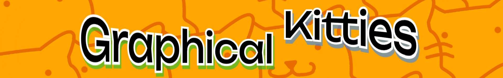

# GK-coding

> "She graphic on my kitty until i-"
> - Alexander Tran

## Welcome to Graphical Kitties
This is a side project me, Alexander Tran, meant to show off all of the cool stuff I made over the 3 years here. 
This GitHub shows off my programming projects only. If you want to see my other stuff (art, irl builds, etc.), head back to the yearbook page.

I code mainly in Python, C++ (through Arduino), and a tiny bit of HTML, but I may expand to other languages like C# or Java.
